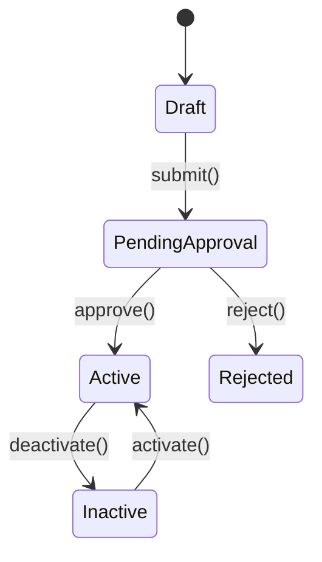

# Purpose
Govern creation and modification of Organization records with a **maker–checker** pattern, ensuring separation of duties and auditability. In **MULTI_TENANT**, Super Admins create/manage multiple Organizations. In **SINGLE_TENANT**, this flow is hidden in UI but APIs may remain for internal ops or seeding.

---

## Actors & Permissions
- **Maker (SuperAdmin)**: Initiates create/update, submits for approval.
- **Checker (SuperAdmin)**: Reviews and approves/rejects; **cannot** be the same user as maker (BR-103).
- **System**: Enforces SLA & auto-rejects on timeout; emits notifications & audit events.
- **RBAC**: Enforced server-side per `authentication-authz.md`; UI is presentation-only.

---

## Preconditions
- Authenticated user has role **SuperAdmin**.
- For **update**, an **Active** Organization exists.
- In **SINGLE_TENANT**, UI surfaces are disabled; only seed/ops paths are allowed.

## Postconditions
- On **approve**: new Organization becomes **Active** (create) OR changes are applied to the Active version (update).
- On **reject**: change set moves to **Rejected**; Active version remains unchanged.
- On **timeout**: **auto-reject** with reason `SLA_BREACH`.

---

## State Machine

- **Immutable field**: `code` once Active (VAL-102).
- **Soft-delete**: use **Inactive**; no hard delete (BR-101).

---

## Change Set Model (for updates)
- **Table**: `org_changesets`
  - `id` (UUID), `org_id` (UUID), `maker_id` (UUID), `checker_id` (UUID, nullable until decision)
  - `payload` (JSONB) – full or partial proposed state (server validates schema)
  - `status` (PendingApproval | Approved | Rejected)
  - `reason` (nullable, text) – required on reject
  - `created_at`, `updated_at`, `decided_at`
- On **PATCH** to an Active Organization:
  - Server creates a **PendingApproval** change set; Active record remains unchanged.
  - Approve applies `payload` transactionally; Reject discards.

---

## Happy Path (Create → Approve)
1. Maker opens **SCR-101** and clicks **Create Organization**.
2. Completes form (Code, Name, `login_domains[]`, optional `vanity_domain`, defaults, branding).
3. Clicks **Submit for Approval** → API: `POST /organizations` with action flag.
4. Server validates (VAL-101..106), saves **Draft** → **PendingApproval**, emits **AUD-ORG-SUBMITTED**.
5. Checker views **SCR-108** (Approvals list), opens **SCR-109** (detail).
6. Checker **Approves** → API: `POST /organizations/{id}:approve` → state **Active**, emits **AUD-ORG-APPROVED**, notifies maker.

## Alternate Paths
- **Reject**: Checker rejects with comment → **Rejected**; maker notified; audit **AUD-ORG-REJECTED**.
- **Edit Draft**: Maker saves as **Draft**; can edit/resubmit; no checker action yet.
- **Timeout**: If no action within **3 business days**, system auto-rejects; reason `SLA_BREACH`.
- **Deactivate/Activate**: Admin action via explicit endpoints; both require maker–checker (BR-103).

---

## Validations (reference)
- **VAL‑101** Required fields present.
- **VAL‑102** `code` format and uniqueness; immutable after **Active**.
- **VAL‑103** Domains validation and uniqueness.
- **VAL‑106** Maker ≠ Checker (enforced at approval time).

---

## Business Rules (reference)
- **BR‑101** No hard delete; block deactivate if child entities exist.
- **BR‑102** Names & codes are unique platform-wide.
- **BR‑103** Maker–checker enforced for Create/Update/Activate/Deactivate.

---

## Notifications
- On **submit**: Notify checker group (Super Admins) – email + in-app toast.
- On **approve/reject**: Notify maker – email + in-app toast.
- On **timeout**: Notify maker and checker group.

---

## Observability & Audit
- **Audit events** (immutable): `AUD-ORG-CREATED`, `AUD-ORG-SUBMITTED`, `AUD-ORG-APPROVED`, `AUD-ORG-REJECTED`, `AUD-ORG-ACTIVATED`, `AUD-ORG-DEACTIVATED`.
- Include: actor_id, org_id, old_state, new_state, diff (for updates), request_id.
- **Metrics**: approval latency (P50/P95), approval rate, rejection rate, SLA breach count.

---

## Error Handling
- 400/422: validation errors → return standardized error envelope (`api-conventions.md`).
- 403: RBAC failure (non-SuperAdmin or maker==checker on approval).
- 404: non-existent org/change set.
- 409: conflict (e.g., duplicate `code`).
- 429: rate limiting (auth endpoints, write ops).

---

## Security
- Auth: Bearer JWT; role **SuperAdmin** required for all endpoints in this workflow.
- Idempotency: Required for create and approval actions.
- CSRF: Enforced for UI forms (server-rendered).

---

## Acceptance Criteria (Gherkin)
```gherkin
Scenario: Maker submits organization for approval
  Given I am logged in as SuperAdmin
  And I have filled all required fields
  When I click "Submit for Approval"
  Then the organization enters "PendingApproval"
  And a notification is sent to checkers

Scenario: Checker rejects with reason
  Given an organization is "PendingApproval"
  When a different SuperAdmin rejects with a comment
  Then the organization state is "Rejected"
  And the maker is notified

Scenario: Auto-reject on SLA breach
  Given an organization is "PendingApproval" for more than 3 business days
  When the system SLA job runs
  Then the change set is marked "Rejected" with reason "SLA_BREACH"
  And the maker and checker group are notified
```
